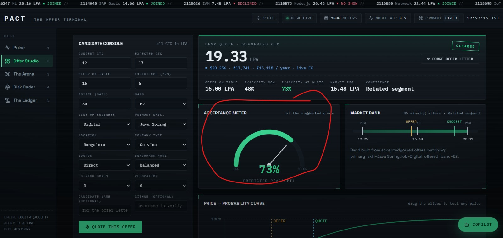
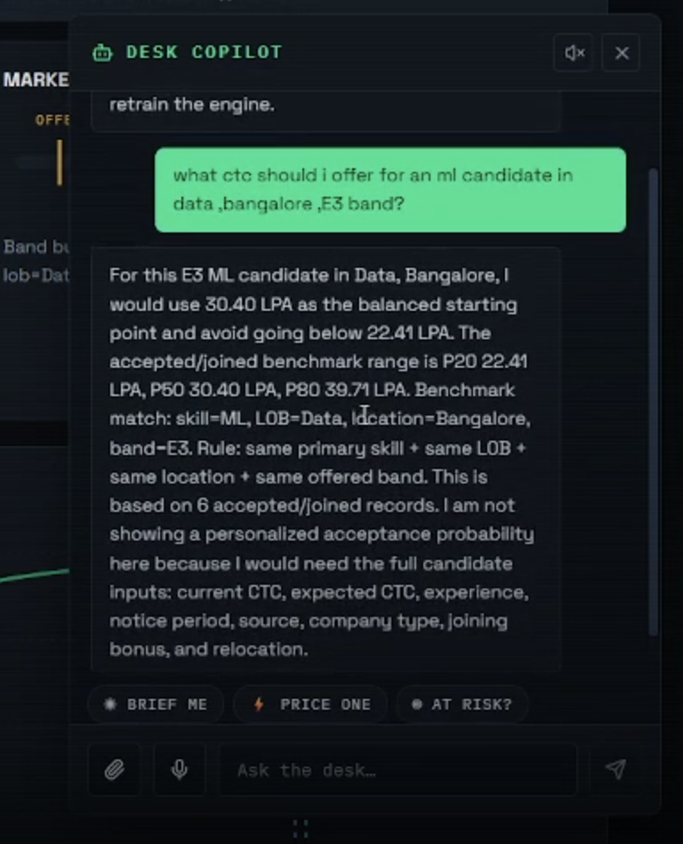
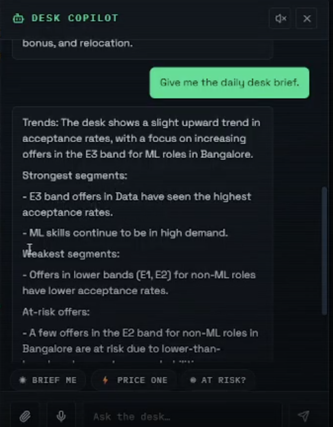
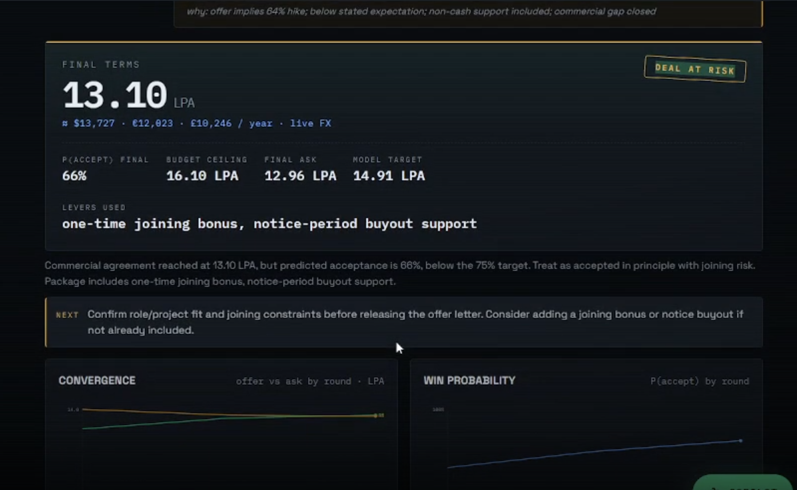
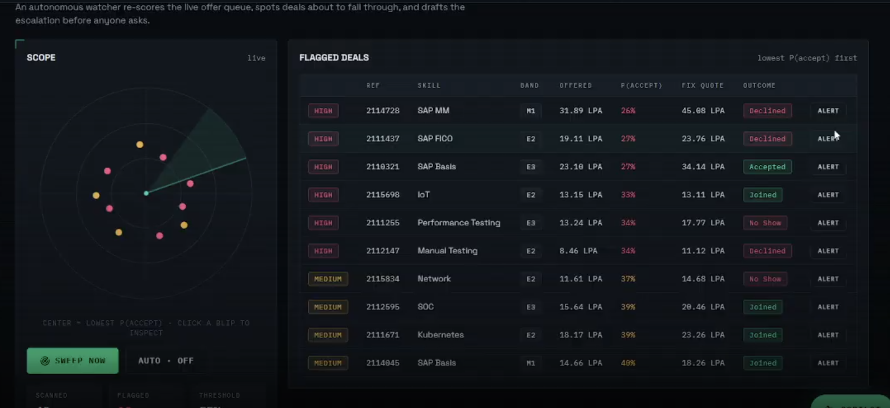
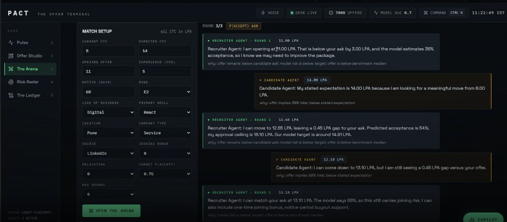

# PACT · The Offer Terminal

> **Every offer is a trade. This is the terminal.**

Compensation is a market — candidates are priced, offers are bids, declines are
losses. PACT (**P**redict · **A**nalyze · **C**lose · **T**alent) treats hiring
exactly that way: a Bloomberg-style trading terminal for job offers, powered by
an acceptance-probability model and three cooperating agents.

## The pitch (30 seconds)

Recruiters guess salaries; candidates ghost; companies overpay or lose the hire.
PACT replaces the guess with a market view:

1. **Price the candidate** like an asset — get a quoted CTC with its win probability.
2. **Stress-test the deal** — two AI agents negotiate it round-by-round before a human ever does.
3. **Never lose silently** — an autonomous radar re-scores live offers and drafts escalations for deals about to fall through.


## Screenshots

### Offer Studio: CTC quote and acceptance meter


### Desk Copilot: salary recommendation


### Desk Copilot: daily desk brief


### The Arena: negotiated final terms


### Risk Radar: flagged live deals


### The Arena: recruiter and candidate agents



## The desk (five screens)

| Screen | What it does |
| --- | --- |
| **01 · Pulse** | Live market overview: win rate, price bands, outcome book, engine health, scrolling offer ticker. |
| **02 · Offer Studio** | Enter a profile → get a **deal ticket**: suggested CTC, acceptance gauge, market band (P20/P50/P80), price↔probability curve, and the comparable winning offers behind it. |
| **03 · The Arena** | A Recruiter Agent (guards budget) vs a Candidate Agent (chases value) negotiate live, round-by-round, grounded in the same acceptance model. Watch offers converge. |
| **04 · Risk Radar** | Autonomous agent sweeps the offer queue on a radar scope — blips closest to center are deals about to be lost — and drafts the escalation alert itself. |
| **05 · The Ledger** | Every trade on the book: recent offers, pricing, and how each settled. |

Plus: a **Desk Copilot** chat drawer (ask questions, upload a CSV/Excel dataset
to retrain the engine live) and a **command palette** (`Ctrl+K`, keys `1–5`
jump between screens).

## Live external integrations

| Feature | External tool | Key needed |
| --- | --- | --- |
| **Voice Desk** | Browser Web Speech API — click VOICE (topbar) or the mic in the Copilot, speak a request, the agent answers out loud | none |
| **GitHub Talent Scanner** | Live GitHub REST API — enter a candidate's GitHub username in the Offer Studio and get a verified skill signal (languages, stars, activity) with a match/mismatch verdict against the claimed skill | none (optional `GITHUB_TOKEN` in `backend/.env` raises the rate limit from 60 to 5,000 req/hr) |
| **Live Market Wire** | open.er-api.com FX rates — every quote shows real USD/EUR/GBP equivalents; the ticker carries live USD/EUR/GBP-INR rates | none |
| **Job-market snapshot** | Adzuna job postings API (optional) | free `ADZUNA_APP_ID` + `ADZUNA_APP_KEY` in `backend/.env` |
| **Offer Letter Forge** | LLM-drafted personalized offer letter + QR code (api.qrserver.com), printable to PDF from a CLEARED deal ticket | uses the existing chat LLM key |

All integrations fail soft: if an external service is unreachable, the UI says
so honestly instead of fabricating data.

## The copilot operates the desk

The Desk Copilot is not a Q&A box — it drives the terminal:

- **Chat drives the desk** — "price a 6-year Python dev in Pune at 18 LPA" makes
  the agent fill the Offer Studio console on screen and run the full quote
  (`PREFILL_SIMULATOR` action). Combined with the Voice Desk this is a fully
  voice-operated terminal.
- **Rich answer cards** — simulation, KPI, and briefing answers render as mini
  visual cards (stat strips, P20/P50/P80 band bars) inside the chat bubbles.
- **Daily Desk Brief** — the "☀ BRIEF ME" chip (or asking for a briefing)
  generates a grounded morning brief: trend direction, strongest/weakest skill
  segment, live at-risk count from the risk agent, and one recommended action.
- **Screen-aware context** — every message silently carries what you're viewing
  and your last quote/negotiation, so follow-ups like "why was this escalated?"
  work without re-typing the candidate profile.

## The engine

- Logistic regression classifier predicting `P(accept | candidate profile, offered CTC)`,
  reported with ROC AUC and Brier score on a held-out set.
- CTC benchmarks from historical accepted-offer percentiles with a transparent
  fallback ladder (strict → broad similarity), shown in the UI as the
  "benchmark search trail".
- Guardrails, not black boxes: every quote ships with its evidence coverage,
  conflicting-signal warnings, and escalation statuses.

## Run

From this folder:

```powershell
.\.venv\Scripts\python.exe -m uvicorn backend.main:app --host 127.0.0.1 --port 8000
```

Then open:

```text
http://127.0.0.1:8000/
```

## Data

The app loads `datasets/synthetic_hr_offer_acceptance_dataset.csv` and creates a
local SQLite database (`ctc_recommender.sqlite3`) at startup. Upload a new
CSV/Excel through the Desk Copilot to retrain the model without restarting.

## Stack

FastAPI + pandas + scikit-learn backend · React 18 (no build step) frontend ·
hand-rolled SVG charts (validated colorblind-safe palette) · LLM-backed copilot
and negotiation agents.
## AMD Notebook Proxy LLM Setup

This is the theoretical AMD GPU deployment flow we would use when running the LLM inside an AMD-hosted Jupyter pod.

```text
Laptop (React + FastAPI + PostgreSQL)
    -> HTTPS
https://notebooks.amd.com/<pod-name>/proxy/<port>/
    -> jupyter-server-proxy
localhost:<port> inside Jupyter pod (vLLM/SGLang on MI300X GPU)
```

### Step 1: Start an LLM Server Inside the Jupyter Pod

Open a terminal in JupyterLab and run:

```bash
vllm serve Qwen/Qwen2.5-7B-Instruct \
  --port 8000 \
  --host 0.0.0.0 \
  --max-model-len 4096
```

### Step 2: Test From Inside the Pod

In another terminal or notebook cell:

```bash
curl http://localhost:8000/v1/models
```

If this returns the model list, the GPU inference server is running.

### Step 3: Access From Outside Using Jupyter Server Proxy

The external URL pattern is:

```text
https://notebooks.amd.com/<pod-name>/proxy/8000/v1/chat/completions?token=<jupyter-token>
```

The `<pod-name>` and `<token>` are available in the JupyterLab browser URL, for example:

```text
https://notebooks.amd.com/jupyter-hack-team-XXXX-260611.../lab?token=abc123
```

The proxy link can also work by removing `/lab` from the JupyterLab URL and using the base notebook URL.

### Step 4: Call From the Local FastAPI Backend

```python
import requests

JUPYTER_BASE = "https://notebooks.amd.com/jupyter-hack-team-XXXX-260611XXXXXX-XXXXXXXX"
TOKEN = "abc123"

response = requests.post(
    f"{JUPYTER_BASE}/proxy/8000/v1/chat/completions",
    params={"token": TOKEN},
    json={
        "model": "Qwen/Qwen2.5-7B-Instruct",
        "messages": [{"role": "user", "content": "Hello!"}],
        "max_tokens": 256,
    },
)

print(response.json())
```

### Notes and Considerations

- `jupyter-server-proxy` is expected to already be installed in the AMD pod.
- Any server port started inside the pod, such as `8000` or `8080`, can be accessed through `/proxy/<port>/`.
- The Jupyter token is required for authentication. Without it, requests may return `403`.
- The React frontend can call the same HTTPS proxy URL.
- The trailing slash can matter: use `/proxy/8000/` rather than `/proxy/8000`.
- If a corporate proxy blocks WebSockets, standard HTTP REST calls to `/v1/chat/completions` should still work because the OpenAI-compatible API does not require WebSockets.
- This setup may depend on network and IT restrictions, so local validation with `curl` should be done first.
